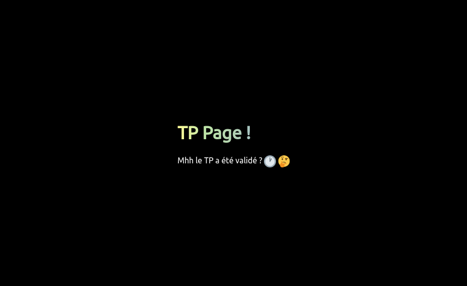

# Page
Prise en main de Github Page (alternative Gitlab Page, Codeberg Page ...).

# TP
Ce TP a pour but de vérifier les connaissances de l'étudiant, sur le logiciel de versionnage Git, et cela, au travers d'une page web héberge par le système Github Page.

## Status du TP :
 
En attende de validation :

Validé :

